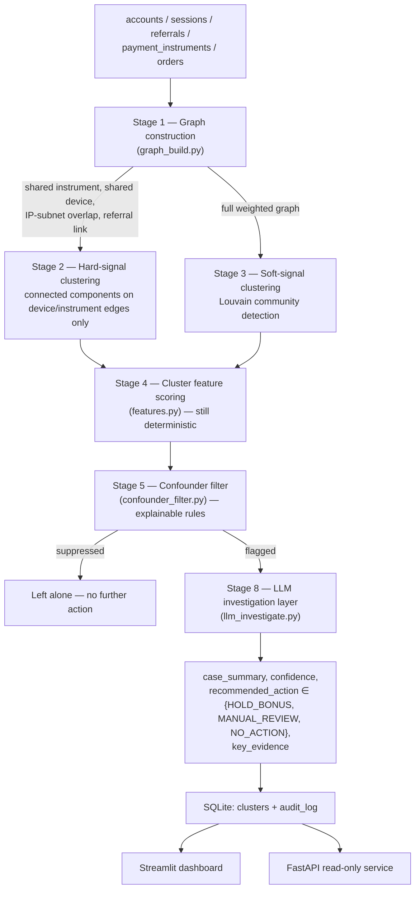

# Architecture

## Pipeline

## Why deterministic-first, LLM last

Stages 1-5 are 100% deterministic — NetworkX graph algorithms and explicit feature thresholds, no model calls. The LLM only ever sees a cluster that has *already* survived five stages of scrutiny, and it receives nothing but the aggregate evidence those stages computed (edge signals, feature scores, the filter's own stated reason) — never raw account data. This means:

- **Every flag is traceable.** A judge, auditor, or analyst can walk from a flagged cluster back to the exact graph edges and feature values that produced it, with no black-box step in between. This is the direct answer to the RBI FREE-AI framework's explainability/auditability expectation.
- **Cost and latency are bounded.** The LLM runs once per *already-flagged* cluster (typically a few dozen calls per cohort of thousands of accounts), not once per account or per transaction.
- **The LLM cannot expand scope.** It writes up a case the deterministic pipeline already built; it cannot go looking for new rings on its own, and its output is constrained to three actions, none of which touch money or accounts directly.

## Stage-by-stage detail

**Stage 1 — Graph construction** (`backend/pipeline/graph_build.py`). Nodes are accounts. Edges come from four signal types, weighted by strength: shared `instrument_hash` (4.0) > shared `device_fingerprint_id` (3.0) > IP-subnet overlap, first three octets (2.0) > referral link (0.8–2.0, scaled up when the bonus claim happens within hours of signup). Every edge records which signal(s) produced it — the basis for the "edges labeled by shared attribute" UI requirement and for every downstream explanation.

**Stage 2 — Hard-signal clustering.** Connected components computed on a subgraph containing *only* shared-device and shared-instrument edges. Two different people legitimately sharing a payment instrument is rare; this stage exists because that signal alone is close to a ground-truth label.

**Stage 3 — Soft-signal clustering.** Louvain community detection (resolution 1.3, tuned against the dev split) over the *full* weighted graph — the only stage that can see rings connected purely by IP overlap and referral-chain timing, with no shared device or instrument at all. This is deliberately the harder case: the eval harness reports its recall separately from Stage 2's, and it is lower (88.9% vs. 100%), honestly.

**Stage 4 — Cluster feature scoring** (`features.py`). For every candidate cluster from Stage 2 or 3: size, edge density, signup-span tightness, average gap between signups, bonus-claim velocity, the fraction of members who claimed a bonus and then went silent for 3+ days ("claim-then-dormant"), order-value coefficient of variation (low = templated/near-identical amounts), and post-signup engagement (sessions occurring more than 7 days after signup — the organic-activity signal).

**Stage 5 — Confounder filter** (`confounder_filter.py`). Rule-based, not learned. A shared instrument is treated as near-certain fraud regardless of other signals (the "legitimate reason for this is rare" argument). A shared device is checked against an *organic score* (spread-out signups ≥21 days, order-value CV ≥0.28, post-signup engagement ≥1.5 sessions/member) — if organic evidence dominates, the flag is suppressed even though a hard signal fired, exactly the household-with-a-shared-tablet case. Soft-signal-only clusters (IP/referral) need either a strong organic score (≥2/3) to be actively cleared, or a strong suspicion score (≥3/4: burst timing, templating, fast claims, dormancy) to be flagged; anything in between defaults to *not* flagging, which is the conservative choice given the cost asymmetry (see below).

**Stage 8 — LLM investigation** (`llm_investigate.py`). Tries a provider chain, degrading on failure: Claude (`claude-opus-5` via `client.messages.parse` structured output) → Gemini free tier (`gemini-flash-lite-latest` via `response_json_schema`) → a deterministic template writeup, same schema, clearly labeled `llm_mode="fallback_template"`. Every provider receives only the Stage 4 evidence and the Stage 5 verdict — never raw account data. Returns `case_summary`, `confidence`, `recommended_action`, `key_evidence`.

Free-tier LLM quotas turned out to be a real engineering constraint worth documenting honestly: the first model tried, `gemini-3.6-flash`, carries a free-tier quota of only 20 requests per **day** per project (discovered empirically — the docs don't clearly state per-model daily caps), which a handful of test calls exhausted immediately. `gemini-flash-lite-latest` has its own, separate, much larger quota (~1,000/day, ~30/minute) and is what Stage 8 actually uses. The pipeline proactively spaces calls to stay under the per-minute limit and retries with the server-suggested backoff on a 429 (up to 3 attempts) before giving up on that provider for the rest of the run — a daily quota exhausting mid-run isn't something a retry can fix, so at that point it correctly degrades to the template for the remaining clusters rather than retrying forever. The system is never blocked on API access either way: with zero credentials it still produces a complete, clearly-labeled result set.

## Cost-weighted framing

A **missed ring** (false negative) means paid-out fraudulent referral bonuses — direct financial loss, recoverable only via clawback if caught later, and often not caught at all. A **wrongly-flagged legitimate cluster** (false positive) means, at most, a delayed bonus payout pending human review — because nothing here auto-executes, the real-world cost is friction and possible churn, not a wrongful punishment. That asymmetry is exactly why Stage 5's soft-signal branch defaults to *not* flagging on ambiguous evidence: an aggressive filter would trade a small, reversible cost (delay) for a larger, less reversible one (an angry legitimate customer whose bonus visibly vanished).

## External validation

Everything above is measured on our own synthetic construction — honest about being synthetic, but still our own. `backend/external_validation/` tests the same unmodified Stage 2/3 clustering against real, independently-labeled fraud data from three external sources, full results and methodology in [`docs/EXTERNAL_VALIDATION.md`](EXTERNAL_VALIDATION.md):

- **YelpChi** (Rayana & Akoglu, KDD 2015) — real fake-review collusion, 45,954 reviews: **99.2% precision, 17.0% recall, 6.8x lift** over the 14.5% base rate.
- **Amazon** (McAuley & Leskovec) — same task, a domain with a much weaker identity-signal analog available: **81.8% precision, 1.1% recall, 11.9x lift** over a 6.9% base rate — reported as the materially weaker result it is, not smoothed over.
- **Elliptic** (Weber et al., 2019) — real Bitcoin transaction graph, the deliberately weakest-fit domain (single relation, no ring-shaped ground truth): Stage 2 correctly finds nothing (no identity relation exists here), Stage 3 alone still gets **72.0% precision, 13.1% recall, 7.3x lift** over a 9.8% base rate.

Precision beats base rate on all three, every time, including the worst-fit domain — the honest signal that the underlying clustering mechanism generalizes, not just an artifact of how our own synthetic data happens to be constructed.

Separately, **TravelFraudBench** (Sajja, arXiv:2604.21093, April 2026) is cited, not run against: an independently-built benchmark that reaches the same starting observation this project did — existing fraud data doesn't test multiple distinct ring *shapes* — and one of its three planted ring types is described as "star topology with shared device/IP clusters," structurally identical to this system's hard-signal pattern, arrived at independently. External validation that the pattern this system is built around is a real, recognized fraud shape, not an artifact of our own construction.

## Known limitations (honest)

- **Real fraud rings are adversarial, not static.** They actively evolve to evade exactly this kind of detection. The planted rings here are necessarily more obvious than a real ring built by someone who has seen a system like this before — this is a demonstration of the *technique*, not a claim that it's evasion-proof.
- **Measured, not just asserted: a patient adversary defeats Stage 5 by design.** `backend/adversarial_stress_test.py` builds one additional ring — a pure referral chain, no shared device, no shared instrument, no shared IP subnet, claims spread 0.5–14 days after signup instead of hours, organic-variance order values (CV 0.48), and ongoing engagement (14.75 sessions/member post-signup) instead of going dormant. Injected into a disposable copy of the real dataset and run through the unmodified pipeline: **Stage 3 does cluster it** — the referral-chain topology alone is enough for Louvain to separate all 8 members into one community — but **Stage 5 does not flag it**, for exactly the reason it's designed to trust: `"spread-out timing, diverse orders, and ongoing engagement dominate — looks like an organic cluster."` An adversary patient enough to fake the confounder signals is, by construction, indistinguishable from the confounders those signals exist to protect. This isn't a bug to fix — loosening Stage 5 to catch this ring would also catch real organic referral trees, trading the false-negative for the false-positive it was built to avoid.
- **This approach is structurally blind to a ring that shares zero attributes.** Push the adversary one step further — no referral link either, fully independent "clean" burner identities — and there is no edge at all for Stage 1 to find. That case wasn't built because it's definitionally untestable: zero edges means zero candidate cluster, with nothing for any graph-clustering approach to see.
- **LLM confidence scores are self-reported, not calibrated probabilities.** They should be read as a rough prioritization signal for a human reviewer, not a statistically meaningful probability of fraud. See the Metrics page's confidence-calibration check for how well self-reported confidence actually tracks ground truth on this dataset.
- **The primary system is a synthetic, bounded demonstration.** It has no access to Razorpay's actual cross-merchant network data (Vulcan) or any real device-fingerprinting/IP-intelligence vendor. The external validation above tests the same clustering machinery against real, independently-labeled fraud data — which strengthens the technique claim — but that data is still review-fraud and blockchain data, not Razorpay's own domain; it is not a claim to outperform network-scale fraud infrastructure.
- **The eval misses are real, not hidden.** On the frozen-seed held-out run (`SEED=20260828`, never seen during threshold tuning): 7 of 40 soft-signal rings are missed, and all 7 are the deliberately "hard mode" variant (slower referral claims, noisier order-value templating) — correctly clustered by Stage 3 but caught by Stage 5's conservative default-no-flag branch, a genuine gap in the soft-signal thresholds, not a pipeline bug. 1 of 40 confounders is wrongly flagged, and it's the deliberately "tight" household variant — a compressed signup window that fails the ≥21-day spread-out check despite otherwise-organic order diversity and engagement. Zero misses on the "easy" variant of either category. See the Metrics page's difficulty breakdown for the live numbers.
