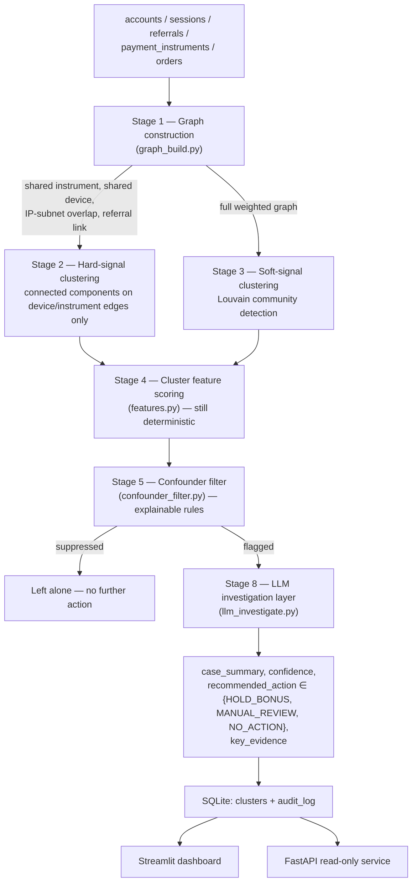

# Architecture

## Pipeline

## Why deterministic-first, LLM last

Stages 1-5 are 100% deterministic — NetworkX graph algorithms and explicit feature thresholds, no model calls. The LLM only ever sees a cluster that has *already* survived five stages of scrutiny, and it receives nothing but the aggregate evidence those stages computed (edge signals, feature scores, the filter's own stated reason) — never raw account data. This means:

- **Every flag is traceable.** A judge, auditor, or analyst can walk from a flagged cluster back to the exact graph edges and feature values that produced it, with no black-box step in between. This is the direct answer to the RBI FREE-AI framework's explainability/auditability expectation.
- **Cost and latency are bounded.** The LLM runs once per *already-flagged* cluster (typically a few dozen calls per cohort of thousands of accounts), not once per account or per transaction.
- **The LLM cannot expand scope.** It writes up a case the deterministic pipeline already built; it cannot go looking for new rings on its own, and its output is constrained to three actions, none of which touch money or accounts directly.

## Stage-by-stage detail

**Stage 1 — Graph construction** (`backend/pipeline/graph_build.py`). Nodes are accounts. Edges come from four signal types, weighted by strength: shared `instrument_hash` (4.0) > shared `device_fingerprint_id` (3.0) > IP-subnet overlap, first three octets (2.0) > referral link (0.8–2.0, scaled up when the bonus claim happens within hours of signup). Every edge records which signal(s) produced it — the basis for the "edges labeled by shared attribute" UI requirement and for every downstream explanation.

**Stage 2 — Hard-signal clustering.** Connected components computed on a subgraph containing *only* shared-device and shared-instrument edges. Two different people legitimately sharing a payment instrument is rare; this stage exists because that signal alone is close to a ground-truth label.

**Stage 3 — Soft-signal clustering.** Louvain community detection (resolution 1.3, tuned against the dev split) over the *full* weighted graph — the only stage that can see rings connected purely by IP overlap and referral-chain timing, with no shared device or instrument at all. This is deliberately the harder case: the eval harness reports its recall separately from Stage 2's, and it is lower (88.9% vs. 100%), honestly.

**Stage 4 — Cluster feature scoring** (`features.py`). For every candidate cluster from Stage 2 or 3: size, edge density, signup-span tightness, average gap between signups, bonus-claim velocity, the fraction of members who claimed a bonus and then went silent for 3+ days ("claim-then-dormant"), order-value coefficient of variation (low = templated/near-identical amounts), and post-signup engagement (sessions occurring more than 7 days after signup — the organic-activity signal).

**Stage 5 — Confounder filter** (`confounder_filter.py`). Rule-based, not learned. A shared instrument is treated as near-certain fraud regardless of other signals (the "legitimate reason for this is rare" argument). A shared device is checked against an *organic score* (spread-out signups ≥21 days, order-value CV ≥0.28, post-signup engagement ≥1.5 sessions/member) — if organic evidence dominates, the flag is suppressed even though a hard signal fired, exactly the household-with-a-shared-tablet case. Soft-signal-only clusters (IP/referral) need either a strong organic score (≥2/3) to be actively cleared, or a strong suspicion score (≥3/4: burst timing, templating, fast claims, dormancy) to be flagged; anything in between defaults to *not* flagging, which is the conservative choice given the cost asymmetry (see below).

**Stage 8 — LLM investigation** (`llm_investigate.py`). `claude-opus-5` via structured output (`client.messages.parse`), given only the Stage 4 evidence and the Stage 5 verdict. Returns `case_summary`, `confidence`, `recommended_action`, `key_evidence`. Falls back to a deterministic template writeup — same schema, clearly labeled — when no Anthropic credentials are available, so the system is never blocked on API access.

## Cost-weighted framing

A **missed ring** (false negative) means paid-out fraudulent referral bonuses — direct financial loss, recoverable only via clawback if caught later, and often not caught at all. A **wrongly-flagged legitimate cluster** (false positive) means, at most, a delayed bonus payout pending human review — because nothing here auto-executes, the real-world cost is friction and possible churn, not a wrongful punishment. That asymmetry is exactly why Stage 5's soft-signal branch defaults to *not* flagging on ambiguous evidence: an aggressive filter would trade a small, reversible cost (delay) for a larger, less reversible one (an angry legitimate customer whose bonus visibly vanished).

## Known limitations (honest)

- **Real fraud rings are adversarial, not static.** They actively evolve to evade exactly this kind of detection. The planted rings here are necessarily more obvious than a real ring built by someone who has seen a system like this before — this is a demonstration of the *technique*, not a claim that it's evasion-proof.
- **This approach is structurally blind to a ring that shares zero attributes.** A "clean" set of burner identities with no device, IP, or payment overlap at all is invisible to a graph-clustering approach by construction — there is no edge to find. Naming this limitation directly matters more than implying the system catches everything.
- **LLM confidence scores are self-reported, not calibrated probabilities.** They should be read as a rough prioritization signal for a human reviewer, not a statistically meaningful probability of fraud.
- **This is a synthetic, bounded demonstration.** It has no access to Razorpay's actual cross-merchant network data (Vulcan) or any real device-fingerprinting/IP-intelligence vendor. It demonstrates the graph-clustering technique on a controlled problem; it is not a claim to outperform network-scale fraud infrastructure.
- **The eval misses are real, not hidden.** At the current 40/40/40 scale: 9 of 40 soft-signal rings are missed, and all 9 are the deliberately "hard mode" variant (slower referral claims spread over hours instead of minutes, noisier order-value templating) — they were correctly clustered by Stage 3 but fell into Stage 5's conservative default-no-flag branch, a genuine gap in the soft-signal thresholds, not a pipeline bug. 2 of 40 confounders are wrongly flagged, and both are the deliberately "tight" household variant — a compressed signup window that fails the ≥21-day spread-out check despite otherwise-organic order diversity and engagement. Zero misses on the "easy" variant of either category. See the Metrics page's difficulty breakdown for the live numbers.
