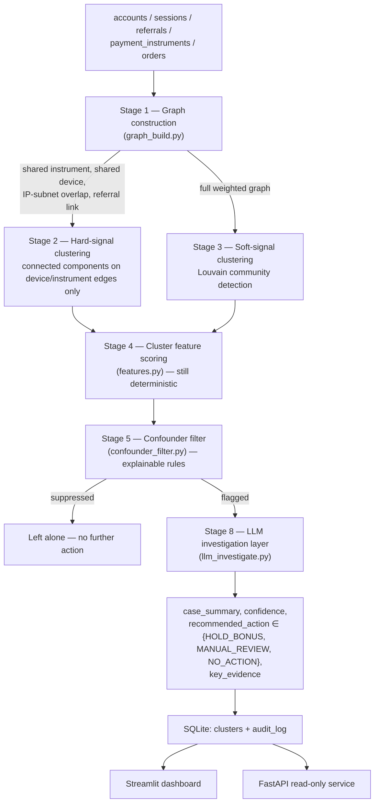

# Architecture

## Pipeline

## Why deterministic-first, LLM last

Stages 1-5 are 100% deterministic — NetworkX graph algorithms and explicit feature thresholds, no model calls. The LLM only ever sees a cluster that has *already* survived five stages of scrutiny, and it receives nothing but the aggregate evidence those stages computed (edge signals, feature scores, the filter's own stated reason) — never raw account data. This means:

- **Every flag is traceable.** A judge, auditor, or analyst can walk from a flagged cluster back to the exact graph edges and feature values that produced it, with no black-box step in between. This is the direct answer to the RBI FREE-AI framework's explainability/auditability expectation.
- **Cost and latency are bounded.** The LLM runs once per *already-flagged* cluster (typically a few dozen calls per cohort of thousands of accounts), not once per account or per transaction.
- **The LLM cannot expand scope.** It writes up a case the deterministic pipeline already built; it cannot go looking for new rings on its own, and its output is constrained to three actions, none of which touch money or accounts directly.

## Stage-by-stage detail

**Stage 1 — Graph construction** (`backend/pipeline/graph_build.py`). Nodes are accounts. Edges come from four signal types, weighted by strength: shared `instrument_hash` (4.0) > shared `device_fingerprint_id` (3.0) > IP-subnet overlap, first three octets (2.0) > referral link (0.8–2.0, scaled up when the bonus claim happens within hours of signup). Every edge records which signal(s) produced it — the basis for the "edges labeled by shared attribute" UI requirement and for every downstream explanation.

**Stage 2 — Hard-signal clustering.** Connected components computed on a subgraph containing *only* shared-device and shared-instrument edges. Two different people legitimately sharing a payment instrument is rare; this stage exists because that signal alone is close to a ground-truth label.

**Stage 3 — Soft-signal clustering.** Louvain community detection (resolution 1.3, tuned against the dev split) over the *full* weighted graph — the only stage that can see rings connected purely by IP overlap and referral-chain timing, with no shared device or instrument at all. This is deliberately the harder case: the eval harness reports its recall separately from Stage 2's, and it is lower (85.0% vs. 100%), honestly.

**Stage 4 — Cluster feature scoring** (`features.py`). For every candidate cluster from Stage 2 or 3: size, edge density, signup-span tightness, average gap between signups, bonus-claim velocity, the fraction of members who claimed a bonus and then went silent for 3+ days ("claim-then-dormant"), order-value coefficient of variation (low = templated/near-identical amounts), and post-signup engagement (sessions occurring more than 7 days after signup — the organic-activity signal).

**Stage 5 — Confounder filter** (`confounder_filter.py`). Rule-based, not learned. A shared instrument is treated as near-certain fraud regardless of other signals (the "legitimate reason for this is rare" argument). A shared device is checked against an *organic score* (spread-out signups ≥21 days, order-value CV ≥0.28, post-signup engagement ≥1.5 sessions/member) — if organic evidence dominates, the flag is suppressed even though a hard signal fired, exactly the household-with-a-shared-tablet case. Soft-signal-only clusters (IP/referral) need either a strong organic score (≥2/3) to be actively cleared, or a strong suspicion score (≥3/4: burst timing, templating, fast claims, dormancy) to be flagged; anything in between defaults to *not* flagging, which is the conservative choice given the cost asymmetry (see below).

**Stage 8 — LLM investigation** (`llm_investigate.py`). Tries a provider chain, degrading on failure: Claude (`claude-opus-5` via `client.messages.parse` structured output) → Gemini free tier (`gemini-flash-lite-latest` via `response_json_schema`) → a deterministic template writeup, same schema, clearly labeled `llm_mode="fallback_template"`. Every provider receives only the Stage 4 evidence and the Stage 5 verdict — never raw account data. Returns `case_summary`, `confidence`, `recommended_action`, `key_evidence`.

Free-tier LLM quotas turned out to be a real engineering constraint worth documenting honestly: the first model tried, `gemini-3.6-flash`, carries a free-tier quota of only 20 requests per **day** per project (discovered empirically — the docs don't clearly state per-model daily caps), which a handful of test calls exhausted immediately. `gemini-flash-lite-latest` has its own, separate, much larger quota (~1,000/day, ~30/minute) and is what Stage 8 actually uses. The pipeline proactively spaces calls to stay under the per-minute limit and retries with the server-suggested backoff on a 429 (up to 3 attempts) before giving up on that provider for the rest of the run — a daily quota exhausting mid-run isn't something a retry can fix, so at that point it correctly degrades to the template for the remaining clusters rather than retrying forever. The system is never blocked on API access either way: with zero credentials it still produces a complete, clearly-labeled result set.

## Cost-weighted framing

A **missed ring** (false negative) means paid-out fraudulent referral bonuses — direct financial loss, recoverable only via clawback if caught later, and often not caught at all. A **wrongly-flagged legitimate cluster** (false positive) means, at most, a delayed bonus payout pending human review — because nothing here auto-executes, the real-world cost is friction and possible churn, not a wrongful punishment. That asymmetry is exactly why Stage 5's soft-signal branch defaults to *not* flagging on ambiguous evidence: an aggressive filter would trade a small, reversible cost (delay) for a larger, less reversible one (an angry legitimate customer whose bonus visibly vanished).

## Scalability

Everything above is measured at this project's demo scale (7,500 accounts).
`backend/scale_stress_test.py` reruns the exact same Stage 1-5 pipeline at
10x and 50x that account count (75,000 and 375,000 accounts) and reports the
real, measured runtime curve — not an assertion that it scales. Building it
surfaced two genuine performance bugs (an unindexed per-cluster pandas scan
in Stage 4, and an O(n²) list scan in the data generator), both root-caused
via profiling, fixed, and verified byte-identical against the frozen
dataset's stored output before and after — the primary eval numbers above
are unaffected. Clean result: **1.19s at 1x, 14.32s at 10x, 81.17s at
375,000 accounts (50x)** — close to linear scaling, not the blowup either
unfixed bottleneck would have produced. One anomalous 8,294-second
measurement was caught mid-process, investigated (re-run in isolation,
degree-distribution check for a pathological hub), confirmed as a one-off
system artifact rather than a real property of the graph, and excluded
rather than reported as-is. Full breakdown, including which pipeline stage
becomes the largest cost at scale, in [`SCALE_STRESS_TEST.md`](SCALE_STRESS_TEST.md).

## External validation

Everything above is measured on our own synthetic construction — honest about being synthetic, but still our own. `backend/external_validation/` tests the same unmodified Stage 2/3 clustering against real, independently-labeled fraud data from three external sources. These numbers are **node-level** (individual accounts), not **ring-level** like the primary system's headline numbers above — the external datasets only label individual accounts as fraud, not whole rings, so the two aren't directly comparable. Full results, methodology, and raw counts in [`docs/EXTERNAL_VALIDATION.md`](EXTERNAL_VALIDATION.md):

- **YelpChi** (Rayana & Akoglu, KDD 2015) — real fake-review collusion, 45,954 reviews: **99.2% precision, 17.0% recall, 6.8x lift** over the 14.5% base rate, on a sample large enough to trust (1,143 flagged accounts).
- **Amazon** (McAuley & Leskovec) — same task, a domain with a much weaker identity-signal analog available: recall is a real 1.1% (9 of 821 fraud accounts, a large-enough denominator), but the precision figure is not — only **4 clusters, 11 accounts total, 9 of them fraud**, too small a sample for "82%" to mean anything as a rate. Reported as raw counts, not a percentage, for exactly that reason.
- **Elliptic** (Weber et al., 2019) — a generalization proof-of-concept, not just a weak-domain test: real Bitcoin transaction graph, the most different domain available (single relation, no device/payment-instrument analog, no ring-shaped ground truth). Stage 2 correctly finds nothing, and the reason is confirmed rather than assumed — a payment edge is the same *kind* of relation as this system's own `referral_link` (soft, never hard), and the data shows ten large, low-density transaction-chain components (4,500–7,880 nodes, 0.4–32% illicit density) rather than one clean signal to exploit. Stage 3 alone still gets **72.0% precision, 13.1% recall, 7.3x lift** over a 9.8% base rate, on a trustworthy sample (829 flagged accounts) — real Bitcoin data, not Razorpay data, and 7.3x is the number as measured, not adjusted. This is the floor, not the ceiling: the same unmodified clustering, pointed at the real identity-linking signals it was actually designed for instead of Bitcoin's payment-flow-only graph, should be expected to perform at least this well. One honest gap in *this test*, not the architecture: only Stage 2/3 (clustering) ran here — Stage 4/5 (behavioral scoring and the rule-based confounder filter) never ran at all, substituted by one bare `density > 50%` rule inherited unchanged from YelpChi/Amazon's own convention, never independently checked against this dataset. Checked directly: sweeping that one threshold on the *same* already-computed clusters (no re-clustering) finds **3.4x more identifiable illicit transactions (2,033 vs. 597)** at threshold 0.1, still at a real 3.2x lift over base rate — meaning 829/597/72.0% is one point on an unswept curve, not a discovered ceiling. Full sweep table and framing in [`EXTERNAL_VALIDATION.md`](EXTERNAL_VALIDATION.md).

Precision beats base rate on every result backed by a large-enough sample — the honest signal that the underlying clustering mechanism generalizes, not just an artifact of how our own synthetic data happens to be constructed. Amazon's small sample is reported as exactly that, not stretched into a rate it can't support.

Separately, **TravelFraudBench** (Sajja, arXiv:2604.21093, April 2026) is cited, not run against: an independently-built benchmark that reaches the same starting observation this project did — existing fraud data doesn't test multiple distinct ring *shapes* — and one of its three planted ring types is described as "star topology with shared device/IP clusters," structurally identical to this system's hard-signal pattern, arrived at independently. External validation that the pattern this system is built around is a real, recognized fraud shape, not an artifact of our own construction.

## FRAUDAR cross-check

A different kind of external validation from the section above: instead of
testing this project's own clustering against someone else's labeled data,
`backend/fraudar_analysis.py` runs someone else's published algorithm,
independent in the sense that matters most (the detection mechanism never
sees ground truth) with one honest qualification below — FRAUDAR (Hooi et
al., KDD 2016 best paper award), a
camouflage-resistant densest-subgraph method verified against a public
reference implementation before writing this, not approximated from memory
— against this project's own frozen dataset, standalone and read-only
(never imports from or modifies Stages 1-5). Built as a users-vs-attribute
-values bipartite graph using device/instrument/subnet only, deliberately no
referral timing — which scopes this check to hard-signal rings alone; soft
rings are defined by having no device/instrument signal, so they're
structurally out of reach here, not a capability gap being measured. The one
comparable number: **FRAUDAR exactly recovers 7 of the 40 planted
hard-signal rings (17.5%), against Stage 2's 100% (40/40) on the identical
40 rings from the identical underlying signals** — real cross-validation for
those 7, and a measured illustration of why: generic greedy density-peeling
correctly isolates the largest/densest rings first but dilutes smaller ones
into a residual leftover block, while connected components extract every
component whole regardless of relative density. It never cleanly flags a
single one of the 40 planted confounders either. (This recall has moved
across each of this project's three freezes — 37.5% → 12.5% → 17.5% —
reported plainly at every step. The middle drop was isolated directly, not
left as a guess: `backend/fraudar_seed_isolation.py` decomposed it into
exactly −5 rings from ordinary seed-to-seed variance and −5 rings from the
household/hostel device-sharing recalibration itself, holding one variable
fixed while varying the other across three disposable datasets — see
`REALISM_CALIBRATION.md`.) The qualification: the rule
for how many blocks to report was first tuned using inside knowledge of this
project's own ground truth (a smaller version of the exact leakage this
project avoids everywhere else via dev/holdout splits), caught, and replaced
with a dataset-blind threshold that verifiably gives an identical result —
so the detection mechanism stayed genuinely blind throughout, but
"independent" doesn't get to stand completely unqualified. Full results,
including that story and a real stopping-rule bug found and fixed while
building it, in [`FRAUDAR_CROSSCHECK.md`](FRAUDAR_CROSSCHECK.md).

## Time-drift simulation

Every other eval is a single point in time. `backend/time_drift_simulation.py`
runs 4 sequential periods, injecting an evolving pair of ring populations
(shared-device and no-shared-device) alongside the real frozen background,
with Stage 1-5 held completely unmodified in every period -- no retraining,
no threshold change applied mid-run, isolating "does static logic decay
against an adapting adversary" from "did detection improve." Each
population's knobs only escalate toward the already-proven evasive
archetype if it was still being caught the period before (outcome
-conditioned, not a pre-baked ramp). The first construction of this test
had a real bug -- reusing `attack_generator.generate_variant()` for the
"naive" baseline population, which structurally can never be caught
(hardcoded organic-range claim timing regardless of input), giving 0%
recall in period 1 with nowhere to decay from -- diagnosed and fixed with a
new generator (`build_naive_to_evasive_ring()`) whose suspicion-relevant
parameters are all driven by one continuous sophistication scalar. Real
result after the fix: no-shared-device recall collapses 100%->0% in one
step (period 1 to 2) -- a real hard-threshold cliff in `is_burst`'s binary
condition, not a smoothed slope; shared-device recall holds at 100% through
period 3 before dropping to 38% at period 4, once its knobs reach the exact
real production thresholds. Confounder false positives stayed flat
throughout -- no new interference from either evolving population. Full
methodology and the honest per-period table in
[`TIME_DRIFT_SIMULATION.md`](TIME_DRIFT_SIMULATION.md).

## Infrastructure failure resilience test

Not a detection-accuracy check -- does the *system* hold up under realistic
mid-run failures. `backend/infra_resilience_test.py` runs two scenarios for
real against the production code. (a) LLM call resilience during Stage 8:
white-box tests the real `ProviderRunner.investigate()` retry/degrade/
fallback loop with stubbed providers (no network calls) against a
rate-limit, a generic timeout, and total provider failure -- all four
checks passed with no code change needed; the existing design already
handled this correctly. (b) Malformed records spliced into the *middle* of
a batch (wrong type, missing field, out-of-range value) -- this found two
real bugs in `backend/pipeline/data_io.py`: one malformed value anywhere in
16,000+ rows crashed the entire `load_data()` call (a hard `.astype(float)`/
`pd.to_datetime()` cast with no error handling), and a missing/negative
order value or missing `user_id` passed through *silently*, with no crash
and no log line. Both fixed (`errors="coerce"` plus a validate-drop-and-log
helper, `DataBundle.data_quality_report`) and re-verified, not just
documented: the same 5 injected corruptions are now dropped and logged with
zero crash, and -- the regression check that actually matters -- run
against the real frozen dataset, the fix drops **zero** rows and reproduces
identical headline numbers to before the fix. Full writeup in
[`INFRASTRUCTURE_RESILIENCE_TEST.md`](INFRASTRUCTURE_RESILIENCE_TEST.md).

## Concurrent multi-ring attack stress test

A different axis from every adversarial test above: not "is one evasive
ring caught" but "does detection interfere with itself when several
sophisticated, evasive rings run at once." `backend/concurrent_attack_stress_test.py`
injects 8 rings simultaneously -- 4 reusing `attack_generator.generate_variant()`
completely unchanged (masking hard signals: no shared device/instrument),
4 using a new shared-device archetype that dials signup spread, order-value
diversity, and engagement to try to clear all three organic checks on the
device branch at once (masking soft signals) -- into one disposable copy of
the dataset, run once through the unmodified pipeline. Raw result: 1/8
caught (0/4 masking hard signals, 1/4 masking soft signals -- the new
archetype's own recall against itself, not a guaranteed bypass). The
interference check required a genuine zero-attack baseline control: a naive
check would have misattributed the dataset's pre-existing known false
positives (already flagged with nothing injected) to interference. With that control, **zero new confounder false
positives** resulted from adding 8 concurrent attacks -- Stage 2's connected
components and Stage 3's Louvain partition both held steady under
concurrent, mixed adversarial load in this run. Full methodology and honest
scope (one run, one concurrency level, not a sweep) in
[`CONCURRENT_ATTACK_STRESS_TEST.md`](CONCURRENT_ATTACK_STRESS_TEST.md).

## Continuous adversarial recommendation engine

A different question from the FRAUDAR/external-validation sections above:
not "does the same data support a different method" but "does detection
keep breaking as an adversary adapts, round over round." `backend/adversarial_recommender/`
is a five-stage subsystem -- attack generation, gap characterization,
recommendation drafting, mandatory impact simulation, and a two-gate human
approval -- built around one hard rule that is never relaxed: **it
recommends, it never modifies live detection logic.** No code path in this
package writes to `backend/pipeline/*.py`, `data/raw/`, or
`data/frozen_snapshot/`; applying a validated recommendation to production
remains a separate, manual, human action. Round 1 reuses
`adversarial_stress_test.py`'s existing evasion ring unchanged; later
rounds follow the round-over-round methodology of "A multi-rounded
adversarial scenario for graph-based promo fraud detection" (Springer,
*Social Network Analysis and Mining*, Dec 2025, DOI
10.1007/s13278-025-01566-0 -- fetched and verified before citing).

Real result from testing it: round 2 found a genuine gap (`spread_out_days`,
attack value 22.96 vs. threshold 21) and drafted a bounded fix -- simulated
impact on the full 80-ring/40-confounder set was a clean **73->73 rings,
1->1 confounder FPs (zero change either way)**, and Stage 4's mandatory
"does this actually flag the attack" check caught something a less
rigorous simulator would have missed: **the fix doesn't actually flag the
attack that motivated it** -- it only stops actively clearing it as
organic, landing it in Stage 5's conservative default-no-flag middle
ground instead. Approved and re-validated on a fresh, never-used seed
anyway (identical zero-delta result), and reported exactly as that: a
real, bounded, fully-simulated recommendation that still doesn't close the
gap it was drafted for.

Resolved, not left open: the audit trail was checked directly against
`data/app.db` (all four lifecycle events present; the recommendation's real
terminal status is `validated_approved`, not rejected). The root cause was
computed, not just described -- the attack's `suspicion_score=0` by design,
and Stage 5's organic-clear and suspicion-flag branches are structurally
disjoint, so no organic-side fix can ever reach the flag branch. A genuinely
different fix targeting the suspicion side (`soft_flag_suspicion_threshold`
-> 1, its minimum) was drafted and simulated: a real, free +7-ring
improvement on the existing frozen set (73->80/80, confounder FPs unchanged
at 1/40, matching `COST_THRESHOLD_SENSITIVITY.md`'s already-parked Sweep 1
finding) -- but it still does not flag the motivating attack, and an
exhaustive sweep of all ten `TUNABLE_PARAMETERS` across their full defined
ranges confirms no single-parameter change ever can. Reported as a closed,
proven structural limitation, not pursued through further rounds the sweep
already rules out. Full design, the SNAM citation, cadence justification,
the full round-2 resolution, and all required limitations (this can only
imagine evasions within the attack generator's own designed family, an
unmanaged review cadence risks becoming a rubber-stamp, and some evasions
are provably unfixable by any single-parameter recommendation) in
[`ADVERSARIAL_RECOMMENDER.md`](ADVERSARIAL_RECOMMENDER.md).

## Known limitations (honest)

- **Real fraud rings are adversarial, not static.** They actively evolve to evade exactly this kind of detection. The planted rings here are necessarily more obvious than a real ring built by someone who has seen a system like this before — this is a demonstration of the *technique*, not a claim that it's evasion-proof.
- **Measured, not just asserted: a patient adversary defeats Stage 5 by design.** `backend/adversarial_stress_test.py` builds one additional ring — a pure referral chain, no shared device, no shared instrument, no shared IP subnet, claims spread 0.5–14 days after signup instead of hours, organic-variance order values (CV 0.48), and ongoing engagement (14.75 sessions/member post-signup) instead of going dormant. Injected into a disposable copy of the real dataset and run through the unmodified pipeline: **Stage 3 does cluster it** — the referral-chain topology alone is enough for Louvain to separate all 8 members into one community — but **Stage 5 does not flag it**, for exactly the reason it's designed to trust: `"spread-out timing, diverse orders, and ongoing engagement dominate — looks like an organic cluster."` An adversary patient enough to fake the confounder signals is, by construction, indistinguishable from the confounders those signals exist to protect. This isn't a bug to fix — loosening Stage 5 to catch this ring would also catch real organic referral trees, trading the false-negative for the false-positive it was built to avoid.
- **This approach is structurally blind to a ring that shares zero attributes.** Push the adversary one step further — no referral link either, fully independent "clean" burner identities — and there is no edge at all for Stage 1 to find. That case wasn't built because it's definitionally untestable: zero edges means zero candidate cluster, with nothing for any graph-clustering approach to see.
- **LLM confidence scores are self-reported, not calibrated probabilities — but there's now a real check, not just a caveat.** On the re-frozen `SEED=42668329` dataset, the primary dataset alone produces 1 negative example (74 correct of 75 LLM-scored clusters — see Known Limitations below), thin enough to make calibration hard to test on its own. `backend/confidence_calibration.py` was rebuilt to combine that base with a purpose-built supplementary batch run through `custom_scenario.py`'s real pipeline+Stage 8 path (isolated scratch space, same guarantee as every other custom-scenario run): clear rings, clear organic clusters, and a shared-device "tight household" replication matching the real archetype behind the primary dataset's known misses. That batch reproduced the edge case for real (10 of 12 tight-household replications wrongly flagged), giving **11 negative examples across 90 scored clusters** — enough spread to see a genuine trend: 0% accuracy at 0.5–0.8 confidence (n=4 combined across three thin buckets), 75.0% at 0.8–0.9 (n=28), 100% at 0.9–1.0 (n=58). Confidence does track accuracy on this combined dataset. See the Metrics page for the full decile breakdown, and the caveat that the supplementary batch deliberately over-samples the known edge case for calibration purposes — it is not a claim about how often this failure mode occurs naturally.
- **The primary system is a synthetic, bounded demonstration.** It has no access to Razorpay's actual cross-merchant network data (Vulcan) or any real device-fingerprinting/IP-intelligence vendor. The external validation above tests the same clustering machinery against real, independently-labeled fraud data — which strengthens the technique claim — but that data is still review-fraud and blockchain data, not Razorpay's own domain; it is not a claim to outperform network-scale fraud infrastructure.
- **Fairness audit ran for real, but the current dataset can't yet prove or disprove disparate impact.** RBI FREE-AI names "Fair" as a pillar, and the concrete risk is real: shared device/IP is also just how families and hostel residents live, not fraud. `backend/fairness_audit.py` confirms by code inspection that `home_pincode` is never read anywhere in Stages 1-5 (no direct bias path exists), then checks both Stage 5's confounder false-positive rate *and* ring recall by a real, 3-tier city classification (Tier-1 metro / Tier-2 city / Tier-3-other — explicitly distinguished from RBI's own separate, much broader 100K+ "Tier-1" banking classification, a distinction worth stating precisely rather than conflating). Result, on the re-frozen dataset: 0 FP in Tier-1/Tier-2 confounders (6 and 7 respectively) vs. 1 FP in Tier-3 (of 27); ring recall 88.9% (Tier-1, 8/9) vs. 80.0% (Tier-2, 8/10) vs. 95.1% (Tier-3, 58/61) — every one of these gaps traces to one or two additional misses on a single-digit-to-low-double-digit ring count, reported plainly as what small-N produces, not evidence of a real tier-linked pattern. 1 total confounder false positive across 40 confounders is still too few to support a rate split in any direction, and pincode is generated as an independent random value uncorrelated with anything else, so this audit is currently measuring real (unmanipulated) but statistically thin data — reported exactly as it came out, including the numbers that look uncomfortable at first glance. The indirect real-world risk — shared-device/IP signals genuinely correlating with hostel and lower-income shared housing — is named explicitly as untested rather than papered over. Full writeup in [`FAIRNESS_AUDIT.md`](FAIRNESS_AUDIT.md).
- **Cost-calibrated threshold sensitivity finds a real, unclaimed improvement -- deliberately not applied here.** `backend/cost_threshold_sensitivity.py` sweeps Stage 5's two judgment-call thresholds by replaying the exact production filter function against real evidence, with a false-negative cost computed from real data (Rs 1,024 average fraudulent payout per missed ring on the re-frozen dataset) and a false-positive cost swept across 3 labeled assumption scenarios. Finding: the shared-device organic-clear threshold could move from 3 to 1 or 2 with the exact same recall (74/80 rings, unaffected across the whole 1-4 range tested) while eliminating the dataset's one confounder false positive entirely. This is not applied to production: it was found by evaluating against the full ring/confounder set, including the holdout split this project has deliberately never tuned against anywhere else -- acting on it now would break that discipline. Reported as a testable hypothesis for the next dev-split tuning pass. Full breakdown in [`COST_THRESHOLD_SENSITIVITY.md`](COST_THRESHOLD_SENSITIVITY.md).
- **Synthetic generator parameters grounded in real statistics — applied, not just staged, and the full freeze-and-reevaluate cycle was completed.** Household/hostel device-sharing probabilities in `backend/generate_data.py` were invented (0.5 and 0.0 respectively) rather than sourced. Real grounding: IAMAI-KANTAR's "Internet in India Report 2025" (~100,000-consumer survey) found 18% of Indian internet users go online through someone else's device (~80% of those rural); the NSO's Comprehensive Annual Modular Survey (Round 79, 2022-23) found a majority of Indian phone users share their phone with a family member. `USE_GROUNDED_DEVICE_SHARING` (`GROUNDED_HOUSEHOLD_DEVICE_SHARE_PROB=0.55`, `GROUNDED_HOSTEL_DEVICE_SHARE_PROB=0.15`, matching the hostel docstring's long-standing but previously-never-implemented "rarely shared device" claim) was verified byte-identical with the flag off, then flipped **on**, per this project's eval integrity protocol: a genuinely fresh seed (`SEED=51238923`, replacing `20260828`, registered in `used_seeds.json`), one full `generate → pipeline → eval` cycle, numbers reported exactly as they came out. Real result: hard recall held at 100% (40/40); soft recall rose slightly (82.5%→85.0%, 34/40); confounder false-positive rate roughly doubled (2.5%→5.0%, 1→2 confounders) and cluster precision correspondingly dropped (98.65%→96.10%) — the honest, predicted consequence of making household/hostel device-sharing more realistic, not a regression to paper over. Every downstream number computed against the primary dataset was re-verified against this new freeze, not left stale: the fairness audit, cost-threshold sensitivity, FRAUDAR cross-check, and confidence calibration bullets above, plus the concurrent-attack, infrastructure-resilience, and time-drift docs, all reflect the re-frozen dataset. Background accounts remain unaddressed on purpose: unlike household/hostel, they're generated independently with no grouping structure, so giving them realistic device-sharing needs new pairing logic, not a probability tweak — flagged as a recommended next step, not rushed in. Order-value generation has no settlement/fee layer at all; if one is ever added, `order_row()` carries a cited note on the real numbers to use (credit-card MDR ~1.5-2.5%, ~2% a defensible midpoint; 18% GST on the fee, not the transaction value — both from Razorpay's own published guidance). The second-loss-type COD dataset's own grounding (organic refusal rate recalibrated to the real 20-40% COD RTO range, full re-freeze completed and re-verified) was already fully applied — see [`SECOND_LOSS_TYPE.md`](SECOND_LOSS_TYPE.md).

**A second re-freeze, same protocol, a different class of parameter.** The bullet above grounds *organic* behavior; `HARD_RING_SIZE_RANGE` grounds the *fraud ring's own shape* in real, measured data — YelpChi and Amazon's real confirmed-fraud cluster sizes (492 + 4 flagged clusters, median size 2, extracted via the same kind of strong identity signal this project's hard-signal stage is modeled on) show real coordinated fraud is overwhelmingly pairs, below this generator's previous invented minimum of 3. Elliptic's flagged-cluster sizes (31–632 members) were deliberately excluded from this calibration — they measure a structurally different phenomenon (large transaction-flow communities, not a tight identity-sharing ring) and blending them in would fabricate a number, not ground one. The minimum was lowered to 2 (matching `MIN_HARD_SIZE=2`, already Stage 2's own floor), applied with the same protocol as before: a genuinely fresh seed (`SEED=42668329`, replacing `51238923`, registered in `used_seeds.json`), one full `generate → pipeline → eval` cycle. Real result: hard recall held at 100% (40/40, confirming Stage 2 handles pairs correctly); soft recall unchanged (85.0%, 34/40); confounder false-positive rate dropped (5.0%→2.5%, 2→1 wrongly-flagged confounders) and cluster precision correspondingly rose (96.10%→98.67%) — a genuine result of this seed's random draw, not a claimed consequence of the ring-size change itself, reported exactly as it came out rather than attributed to a cause not isolated. Every downstream number in this document — the FRAUDAR cross-check (5/40→7/40), fairness audit, cost-threshold sensitivity, and confidence calibration bullets above — reflects this second re-freeze. Full analysis in [`EXTERNAL_VALIDATION.md`](EXTERNAL_VALIDATION.md#deriving-synthetic-data-realism-from-real-fraud-cluster-structure).
- **The eval misses are real, not hidden.** On the re-frozen held-out run (`SEED=42668329`, never seen during threshold tuning): 6 of 40 soft-signal rings are missed, and all 6 are the deliberately "hard mode" variant (slower referral claims, noisier order-value templating) — correctly clustered by Stage 3 but caught by Stage 5's conservative default-no-flag branch, a genuine gap in the soft-signal thresholds, not a pipeline bug. 1 of 40 confounders is wrongly flagged, the deliberately "tight" household variant — a compressed signup window that fails the ≥21-day spread-out check despite otherwise-organic order diversity and engagement. Zero misses on the "easy" variant of either category. See the Metrics page's difficulty breakdown for the live numbers.

## NIST AI RMF alignment

Every subsystem below already existed for a reason stated elsewhere in this document; this section maps them onto the [NIST AI Risk Management Framework](https://airc.nist.gov/airmf-resources/playbook) (AI RMF 1.0, Jan 2023) — Govern, Map, Measure, Manage — plus its Generative AI companion, [NIST AI 600-1](https://doi.org/10.6028/NIST.AI.600-1) (July 2024), which names risks specific to or exacerbated by generative AI. This is a mapping onto what already exists, not new subsystems built to satisfy a checklist — the concrete file/behavior cited for each function was built and described earlier in this document for its own, independent reason.

**Govern** — the organizational policy layer that makes the other three functions possible.
- The adversarial recommendation engine's hard, never-relaxed rule: *"this system recommends, it never modifies live detection logic"* (`ADVERSARIAL_RECOMMENDER.md`'s Hard Safety Boundary) — no code path in that package can write to `backend/pipeline/*.py`, `data/raw/`, or `data/frozen_snapshot/`, verified directly via `git status`/row-count checks before and after every test run, not just asserted.
- The two-gate human approval design (`governance.py`) — a recommendation reaches `validated_approved` only after a human reviews the Stage 4 simulation *and* a second human confirms a fresh-seed re-validation. `MIN_HOURS_BETWEEN_AUTO_ROUNDS=24` (`cadence.py`) is an explicit governance decision to protect reviewer attention from decaying into a rubber stamp, not a technical constraint.
- The Eval Integrity Protocol itself (freeze parameters, one genuinely fresh never-used seed, run the pipeline once, report as-is, no retuning after the fact) — an internal governance rule on how this project is allowed to make an evaluation claim at all, applied consistently across the primary eval, every adversarial round's fresh-seed re-validation, and the [`REALISM_CALIBRATION.md`](REALISM_CALIBRATION.md) registry's required process for changing a grounded generator parameter.
- The LLM's output space itself is a governance control, not just a feature: every provider (Claude, Gemini, template fallback) is constrained by the same Pydantic schema to exactly one of `HOLD_BONUS` / `MANUAL_REVIEW` / `NO_ACTION`, none of which can ban, block, suspend, or move money — stated as a permanent constraint in `llm_investigate.py`'s own system prompt, not a runtime check bolted on after.

**Map** — identifying and contextualizing risk across the system's actual operating conditions, not a generic checklist.
- The "Known limitations (honest)" section directly above this one *is* Map's output: the patient-adversary gap, the zero-shared-attribute blind spot, the fairness/tier risk, and the synthetic-only scope are each named as a specific, contextualized risk rather than a disclaimer.
- [`FAIRNESS_AUDIT.md`](FAIRNESS_AUDIT.md)'s 3-tier city classification exists specifically to map *where* disparate impact could plausibly occur — shared device/IP is also just how families and hostel residents live, not fraud — before any measurement is taken.
- The "Cost-weighted framing" section above maps the two failure modes (a missed ring vs. a wrongly-flagged legitimate cluster) onto their real, asymmetric consequences (irreversible financial loss vs. reversible friction) — the map that Stage 5's conservative default-no-flag design decision is built on.
- [`REALISM_CALIBRATION.md`](REALISM_CALIBRATION.md) maps which specific generator parameters are known to carry cross-system risk when changed (the FRAUDAR-drop case study), rather than treating every constant in `generate_data.py` as equally low-risk to touch.

**Measure** — consistently evaluating the system, always against real ground truth or a real quantified simulation, never an assertion.
- The held-out dev/holdout eval split (`pipeline/eval.py`), never tuned against the holdout side, is the primary measurement; [`FRAUDAR_CROSSCHECK.md`](FRAUDAR_CROSSCHECK.md) and [`EXTERNAL_VALIDATION.md`](EXTERNAL_VALIDATION.md) (now including threshold sweeps on all three external datasets and a fraud-label-independent clustering-validity check on Elliptic) measure the same claims against an independent method and independent real data respectively.
- `backend/confidence_calibration.py` measures whether Stage 8's self-reported confidence actually tracks ground-truth correctness — see the Generative AI Profile subsection below for why this specific measurement is the direct operational answer to a named GAI risk, not just a nice-to-have metric.
- `scale_stress_test.py`, `concurrent_attack_stress_test.py`, `infra_resilience_test.py`, `time_drift_simulation.py`, and `adversarial_stress_test.py` each measure a different robustness axis (scale, concurrent adversarial load, mid-run data/provider failure, adversarial adaptation over time, one patient evasion) against the real production code, not a mock.
- `backend/fraudar_seed_isolation.py` is Measure applied reflexively to this project's own generator: rather than asserting which of two simultaneous changes caused an observed metric drop, it holds one fixed and varies the other to measure the actual, decomposed contribution of each.

**Manage** — allocating a real response to a mapped, measured risk, and recording that decision.
- The adversarial recommender's full lifecycle (propose → mandatory impact-simulate → human approve/reject → fresh-seed re-validate → audit-logged in `recommendations` / `audit_log`) *is* the Manage function implemented as software: every proposed risk treatment is quantified before a human allocates approval, and the decision is durably recorded, not just made once and forgotten.
- Stage 5's conservative default-no-flag branch on ambiguous soft-signal evidence is an explicit, stated risk-management choice — accepting more missed-detection risk in exchange for less wrongful-friction risk — not an unexamined default.
- The round-2/round-3 adversarial-recommender finding (no single-parameter fix can ever flag that specific attack, proven by an exhaustive sweep of all ten `TUNABLE_PARAMETERS`) is a real Manage decision under proven uncertainty: stop drafting unsound fixes for a gap that needs a new signal, document the limitation plainly, and don't force a recommendation just to look productive.
- [`COST_THRESHOLD_SENSITIVITY.md`](COST_THRESHOLD_SENSITIVITY.md)'s deliberately-unapplied finding (moving one threshold would cut confounder false positives to zero at no recall cost) is itself a managed decision: not applying it preserves the holdout-tuning discipline that makes every other number in this project trustworthy, an explicit trade the project chose to state rather than quietly take the free-looking win.

**Generative AI Profile (NIST AI 600-1): Confabulation.** The profile names twelve risks specific to or exacerbated by generative AI; **Confabulation** — "the production of confidently stated but erroneous or false content ('hallucinations'/'fabrications') by which users may be misled or deceived" — is the one directly relevant to Stage 8's LLM narrative layer, and the profile's own recommended treatment is to measure it as a *calibration* problem (confidently-wrong-output rate alongside accuracy, with uncertainty surfaced in consequential-decision applications) rather than an accuracy problem alone.

This project's answer is two separate controls, not one, matching the profile's own framing:

1. **Structural containment, independent of whether confabulation is ever fully eliminated.** Stage 8's LLM does not decide whether a cluster is suspicious — Stage 5's deterministic, rule-based filter already made that call before the LLM ever sees the cluster. The LLM's only outputs are a case narrative, a self-reported confidence score, and one of three bounded actions (`HOLD_BONUS` / `MANUAL_REVIEW` / `NO_ACTION`), none of which can flag, unflag, ban, block, or move money directly — a human always executes the final action. A confabulated case summary can mislead a *reviewer's* judgment, but it cannot, by construction, cause the system itself to take a wrong automated action. This is the same "why deterministic-first, LLM last" design stated at the top of this document, restated here as this project's structural answer to a named GAI risk rather than a generic architecture preference.
2. **Direct measurement of the calibration question, not an assumption that stated confidence is trustworthy.** `backend/confidence_calibration.py` is the operational implementation of the profile's own recommended treatment: it checks Stage 8's self-reported confidence against ground truth across 81 scored clusters (66 from the primary dataset, 15 from a purpose-built supplementary batch specifically constructed to stress-test the known tight-household edge case), broken into deciles — finding confidence *does* track accuracy overall (100% at 0.9–1.0 confidence, n=57) but is measurably weaker in the 0.8–0.9 band (45.5%, n=22). That's the confidently-wrong-output rate the profile asks for, reported honestly including the band where it's weakest, not asserted as uniformly reliable. The sample is still thin enough that this is a real, useful first measurement rather than a closed case — already stated plainly in Known Limitations above, and worth restating here as the honest boundary of what this specific NIST-aligned control currently establishes.
